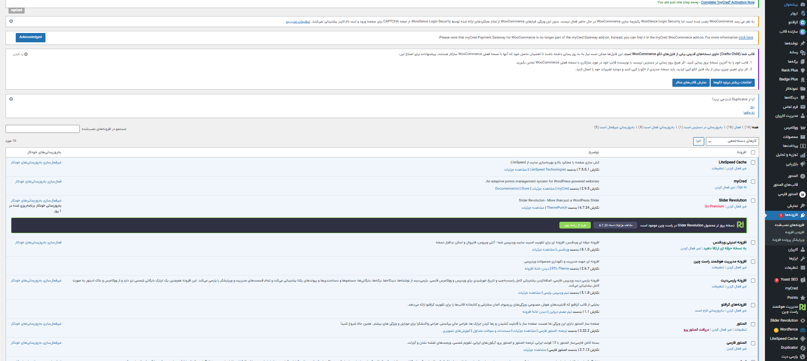

# abolfazl-shafieei-Wordpress-resume
# 📌 رزومه — پروژه وردپرس | Resume — WordPress Project

## 👤 ابوالفضل شفیعی | Abolfazl Shafieei
سن: 18  
نقش: توسعه‌دهنده وب (جونیور)  
تخصص: راه‌اندازی و پیکربندی وردپرس  

Age: 18  
Role: Junior Web Developer  
Specialty: WordPress Setup & Plugin Configuration  

---

## 🎯 پروژه: وبسایت چندمنظوره وردپرس | Project: Multipurpose WordPress Website
**تاریخ:** 20 سپتامبر 2025  
**وضعیت:** تکمیل‌شده  

**Date:** 20 Sep 2025  
**Status:** Completed  

---

## ✅ کارهایی که انجام شد | What I did
- نصب و پیکربندی افزونه‌های کلیدی وردپرس  
- تنظیمات پایه وردپرس (پیوند یکتا، نقش‌ها، timezone)  
- ساخت صفحات اولیه (خانه، درباره ما، تماس)  
- تهیه مستندات و اسکرین‌شات‌های پیکربندی  

Installed and configured essential WordPress plugins  
Configured WordPress settings (permalinks, roles, timezone)  
Created base pages (Home, About, Contact)  
Prepared documentation and screenshots for configuration  

---

## 📸 تصاویر | Screenshots

### 📌 داشبورد وردپرس | WordPress Dashboard

---
## 📂 محتویات ریپو | Repository Contents
- `screenshots/` → لیست افزونه‌ها و داشبورد  
- `docs/configuration-notes.md` → یادداشت‌های پیکربندی  
- `demo/video-demo.mp4` (اختیاری)  

---

## 🌐 لینک‌ها | Links
- پروفایل گیت‌هاب: [https://github.com/abolfazl-shafieei](https://github.com/abolfazl-shafieei)  
- لینکدین: [به‌زودی اضافه می‌شود]  

---

## 📝 یادداشت | Notes
این اولین پروژه وردپرس من است که در مسیر یادگیری و ساخت نمونه‌کار مستند شده است.  

This is my first WordPress project documented as part of my learning and portfolio building journey.

